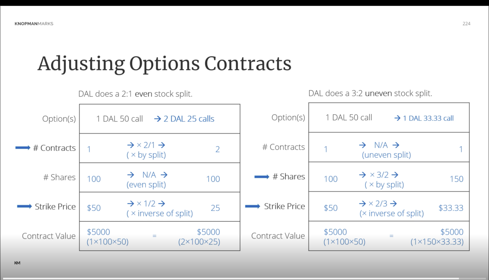
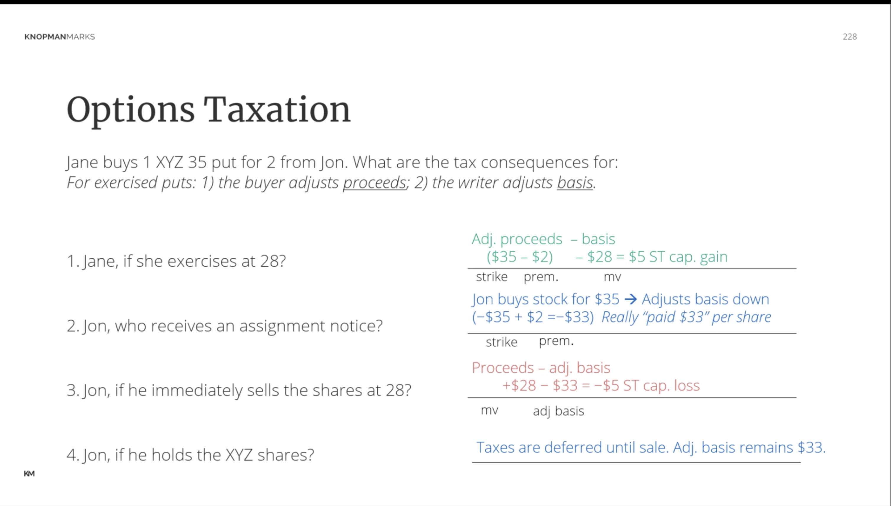

# Options Profit Calculation Charts

## 1. Collar Strategy

Assumptions:

- 100 shares of XYZ stock purchased at $50
- Long XYZ 45 put at $2
- Short XYZ 55 call at $1.75
- Net cost of options: $0.25 per share

| Stock Price at Expiration | Stock P/L | Put Value | Call Value | Net Options P/L | Total P/L |
| ------------------------- | --------- | --------- | ---------- | --------------- | --------- |
| $40                       | -$1000    | $500      | $0         | $475            | -$525     |
| $45                       | -$500     | $0        | $0         | -$25            | -$525     |
| $50                       | $0        | $0        | $0         | -$25            | -$25      |
| $55                       | $500      | $0        | $0         | -$25            | $475      |
| $60                       | $500      | $0        | -$500      | -$525           | -$25      |

## 2. Long Straddle

Assumptions:

- Long May Coca-Cola 65 call at $4
- Long May Coca-Cola 65 put at $4
- Total premium paid: $8 per share

| Stock Price at Expiration | Call Value | Put Value | Total Option Value | Net P/L |
| ------------------------- | ---------- | --------- | ------------------ | ------- |
| $50                       | $0         | $15       | $15                | $7      |
| $57                       | $0         | $8        | $8                 | $0      |
| $65                       | $0         | $0        | $0                 | -$8     |
| $73                       | $8         | $0        | $8                 | $0      |
| $80                       | $15        | $0        | $15                | $7      |

## 3. Short Straddle

Assumptions:

- Short May Coca-Cola 65 call at $4
- Short May Coca-Cola 65 put at $4
- Total premium received: $8 per share

| Stock Price at Expiration | Call Loss | Put Loss | Total Option Loss | Net P/L |
| ------------------------- | --------- | -------- | ----------------- | ------- |
| $50                       | $0        | -$15     | -$15              | -$7     |
| $57                       | $0        | -$8      | -$8               | $0      |
| $65                       | $0        | $0       | $0                | $8      |
| $73                       | -$8       | $0       | -$8               | $0      |
| $80                       | -$15      | $0       | -$15              | -$7     |

