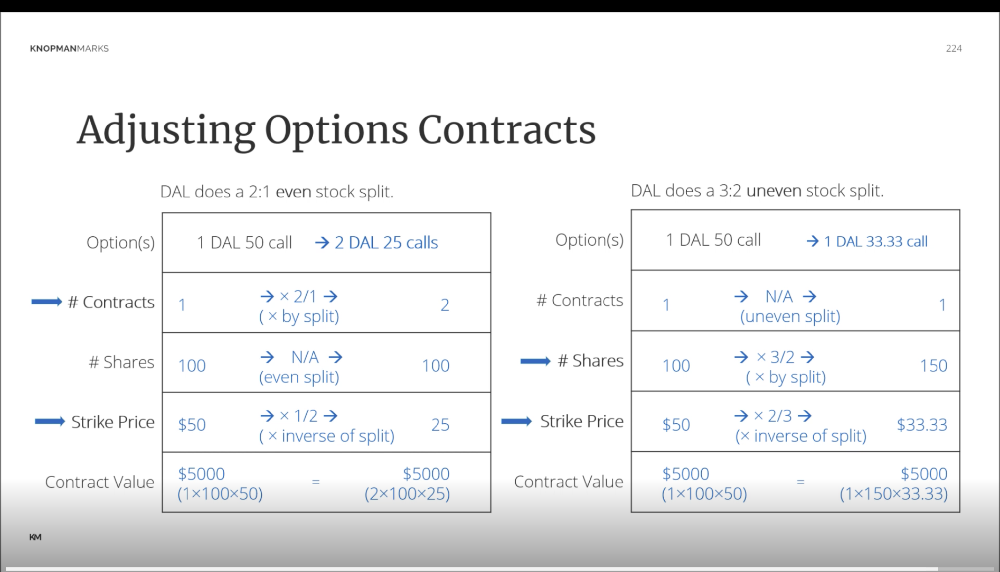

Study Guide: Detailed Explanation of Advanced Options Strategies

I. Introduction to Advanced Options Strategies

A. Continuation from basic options and hedging

- This unit builds upon previously covered basic options concepts and hedging strategies
- Assumes foundational knowledge of options terminology and mechanics

B. Focus areas:

1.  Spreads: Combined options positions using multiple contracts
2.  Straddles: Simultaneous purchase or sale of a call and put with same strike and expiration
3.  Collars: Strategy combining a protective put with a covered call
4.  Butterflies: Complex strategy involving multiple options at different strike prices

C. Additional topics:

1.  Taxation of options: How different options transactions are taxed
2.  Options expiration and exercise: Processes and outcomes when options reach expiration or are exercised
3.  Non-equity options: Using options on other underlying assets like interest rates or currencies

II. Spreads

A. Definition:

- Simultaneously buying one option and selling another of the same class
- **Same class** means both options must be calls or both must be puts
- Creates a combined position with unique risk-reward characteristics

B. Characteristics:

1.  Moderate positions: Less risky than outright long or short options
2.  Defined and limited max gains and losses: Risk is capped in both directions
3.  All profit/loss occurs between the two strike prices: Key concept for understanding spread behavior

C. Types of Spreads:

1.  **Vertical (Price) Spread**:
    - Same expiration, different strike prices
    - Example: Buy July 50 call, sell July 55 call
2.  **Horizontal (Calendar/Time) Spread**:
    - Same strike price, different expiration months
    - Example: Buy December 60 put, sell September 60 put
3.  **Diagonal Spread**:
    - Different strike prices and expiration months
    - Example: Buy January 45 call, sell October 50 call

D. Credit vs. Debit Spreads:

1.  **Debit Spread**:
    - Buy the more expensive (dominant) option
    - Net outflow of cash to enter position
    - Investor wants spread to widen (difference between option prices to increase)
    - Max loss is limited to net premium paid
2.  **Credit Spread**:
    - Sell the dominant option
    - Net inflow of cash when entering position
    - Investor wants spread to narrow (difference between option prices to decrease)
    - Max gain is limited to net premium received

E. Identifying Dominant Position:

1.  Calls: Lower strike price is dominant (more valuable)
2.  Puts: Higher strike price is dominant (more valuable)
3.  Calendar spreads: Later expiration is dominant (more time value)
4.  If premiums given: Higher premium option is dominant

III. Straddles

A. Definition:

- Simultaneously buying or selling two options of different classes with same strike and expiration
- Combines a call and a put with identical strike prices and expiration dates

B. Types:

1.  **Long Straddle**:
    - Buy a call and buy a put
    - Profits from large price movements in either direction
2.  **Short Straddle**:
    - Sell a call and sell a put
    - Profits from little or no price movement

C. Suitability:

1.  Long Straddle:
    - Speculate on high volatility
    - Used when investor expects significant price movement but unsure of direction
2.  Short Straddle:
    - Speculate on low volatility (flat market)
    - Used to generate income when investor expects little price movement

IV. Analyzing Spreads

A. Steps:

1.  Identify net premium (debit or credit):
    - Calculate the difference between premiums paid and received
2.  Determine market view (bullish or bearish):
    - Based on whether the investor is net long or short options
3.  Identify if investor wants spread to widen or narrow:
    - Debit spreads benefit from widening
    - Credit spreads benefit from narrowing

B. Examples:

1.  Call Debit Spread:
    - Bullish outlook
    - Want spread to widen
    - Profit if underlying price rises moderately
2.  Call Credit Spread:
    - Bearish or neutral outlook
    - Want spread to narrow
    - Profit if underlying price stays below certain level
3.  Put Credit Spread:
    - Bullish or neutral outlook
    - Want spread to narrow
    - Profit if underlying price stays above certain level
4.  Put Debit Spread:
    - Bearish outlook
    - Want spread to widen
    - Profit if underlying price falls moderately

V. Spreads Without Premiums

A. Identify dominant position based on strike prices:

- For calls, lower strike is dominant
- For puts, higher strike is dominant

B. Determine credit or debit spread:

- If selling dominant option, it's a credit spread
- If buying dominant option, it's a debit spread

C. Infer market view:

- Credit call spread or debit put spread: Bearish
- Debit call spread or credit put spread: Bullish

VI. Creating Spreads

A. Adding positions to create specific spread types:

- Consider existing option position
- Choose appropriate second option to create desired spread

B. Considering existing positions when adding new options:

- Ensure new option matches class of existing option for spreads
- Select appropriate strike and expiration to achieve desired risk-reward profile

[End of Notes]

# Advanced Options Strategies: Numerical Examples and Butterfly Spreads

## I. Call Spread Example 1

- Long DBX 20 call at $4
- Short DBX 25 call at $2

**Market View**: Moderately bullish
**Position Name**: Debit call spread (or bull call spread)
**Net Premium**: -$2 (debit)

### Profit/Loss Analysis at Different Market Values:

1. At $20 (At-the-money for long call):

   - Long 20 call: $0 (at-the-money)
   - Short 25 call: $0 (out-of-the-money)
   - P/L: -$2 (net premium paid)

2. At $22 (Breakeven):

   - Long 20 call: +$2 (in-the-money)
   - Short 25 call: $0 (out-of-the-money)
   - P/L: $0 (breakeven point)

3. At $25 (Upper bound):
   - Long 20 call: +$5 (in-the-money)
   - Short 25 call: $0 (at-the-money)
   - P/L: +$3 (max profit)

**Key Points**:

- Breakeven is always between the strikes
- Max gain/loss occurs at or beyond the strike prices

## II. Call Spread Example 2

- Short DSM 40 call at $8
- Long DSM 50 call at $3

**Market View**: Moderately bearish
**Position Name**: Credit call spread (or bear call spread)
**Net Premium**: +$5 (credit)

### Profit/Loss Analysis at Different Market Values:

1. At $0 (Far out-of-the-money):

   - Short 40 call: +$8 (premium received)
   - Long 50 call: -$3 (premium paid)
   - P/L: +$5 (max profit)

2. At $45 (Breakeven):

   - Short 40 call: -$5 (in-the-money loss)
   - Long 50 call: $0 (out-of-the-money)
   - P/L: $0 (breakeven point)

3. At $100 (Far in-the-money):
   - Short 40 call: -$60 (in-the-money loss)
   - Long 50 call: +$50 (in-the-money gain)
   - P/L: -$5 (max loss)

**Key Points**:

- Profit/loss remains constant beyond the strike prices
- Analyze each position independently, then combine results

## III. Butterfly Spread

**Definition**: A long butterfly call spread involves:

1. Buying a low strike call
2. Selling two calls at a higher strike
3. Buying another call at an even higher strike

**Example**:

- Buy 1 call at 40
- Sell 2 calls at 45
- Buy 1 call at 50

**Investment Profile**:

- Investor believes stock will remain near the center strike
- Max gain if stock doesn't move
- Limited max loss if stock moves outside lower or upper strikes

**Key Characteristics**:

- Uses 4 option contracts
- Involves 3 strike prices
- All contracts have the same expiration date
- Cannot be created with just two options

**Suitability**:

- For investors expecting low volatility
- Profit potential is limited but defined
- Risk is also limited and defined

[End of Notes]

Certainly. I'll provide a more detailed breakdown of the concepts covered:

# Advanced Options Strategies: Detailed Study Guide

## I. Collar Strategy

**Definition**: A three-part strategy involving long stock, a long put, and a short call.

**Components**:

1. Long stock position (already owned by investor)
2. Long out-of-the-money put (for downside protection)
3. Short out-of-the-money call (to offset put cost)

**Detailed Example**:

- Long 100 shares XYZ at $50
- Buy XYZ 45 put at $2 (costs $200)
- Sell XYZ 55 call at $1.75 (receives $175)

**Net Cost Calculation**:

- Put cost: $200
- Call premium received: $175
- Net cost: $200 - $175 = $25 ($0.25 per share)

**Benefits Breakdown**:

1. Downside Protection:
   - Limited loss to $5 per share (plus $0.25 net cost)
   - Worst case: Stock drops to/below $45, investor sells at $45
2. Upside Potential:
   - Limited gain to $5 per share (minus $0.25 net cost)
   - Best case: Stock rises to/above $55, investor sells at $55
3. Low Cost:
   - $0.25 per share for protection is relatively inexpensive

**Suitability Factors**:

- Investor outlook: Neutral to moderately bullish
- Risk tolerance: Seeks downside protection
- Market concerns: Worried about potential overall market decline
- Cost sensitivity: Wants low-cost protection strategy

## II. Straddles

### A. Long Straddle

**Components**:

- Long call + Long put (same strike price and expiration date)

**Detailed Characteristics**:

1. Market View: Expecting high volatility
2. Profit Potential: Unlimited in either direction
3. Maximum Loss: Limited to total premium paid
4. Break-even Points:
   - Upper: Strike price + total premium paid
   - Lower: Strike price - total premium paid

**Example Calculation**:

- Long XYZ 50 call at $3
- Long XYZ 50 put at $2
- Total premium paid: $5
- Upper break-even: $50 + $5 = $55
- Lower break-even: $50 - $5 = $45

### B. Short Straddle

**Components**:

- Short call + Short put (same strike price and expiration date)

**Detailed Characteristics**:

1. Market View: Expecting low volatility
2. Profit Potential: Limited to total premium received
3. Maximum Loss: Unlimited in either direction
4. Break-even Points:
   - Upper: Strike price + total premium received
   - Lower: Strike price - total premium received

**Example Calculation**:

- Short XYZ 50 call at $3
- Short XYZ 50 put at $2
- Total premium received: $5
- Upper break-even: $50 + $5 = $55
- Lower break-even: $50 - $5 = $45

## III. Straddle Example (Coca-Cola)

**Long Straddle**:

- Long May KO 65 call
- Long May KO 65 put
- Net premium: $8

**Detailed Profitability Analysis**:

1. Break-even points:
   - Lower: $65 - $8 = $57
   - Upper: $65 + $8 = $73
2. Profit scenarios:
   - If KO < $57: Profit = $57 - KO price
   - If KO > $73: Profit = KO price - $73
3. Maximum loss: $8 per share (occurs if KO = $65 at expiration)

**Short Straddle** (counterparty):

- Short May KO 65 call
- Short May KO 65 put
- Net premium received: $8

**Detailed Profitability Analysis**:

1. Break-even points: Same as long straddle ($57 and $73)
2. Profit scenarios:
   - If $57 < KO < $73: Profit = $8 - |$65 - KO price|
3. Maximum profit: $8 per share (occurs if KO = $65 at expiration)
4. Loss scenarios:
   - If KO < $57: Loss = |$57 - KO price|
   - If KO > $73: Loss = |KO price - $73|

## IV. Combinations

**Definition**: Similar to straddle but with different strike prices for the call and put.

**Types**:

1. Short combination:
   - Short call at strike price X
   - Short put at strike price Y (where X ≠ Y)
2. Long combination:
   - Long call at strike price X
   - Long put at strike price Y (where X ≠ Y)

**Key Differences from Straddles**:

- Asymmetric risk/reward profile
- Different break-even points
- Potentially lower cost (for long combinations)

## V. Options in Retirement Plans

**ERISA-Qualified Corporate Retirement Plans**:

- Examples: 401(k), profit-sharing plans

**Options Trading Rules**:

1. Generally allowed, subject to plan rules
2. Must conform to general objectives of the plan
3. Typically limited to conservative strategies

**Considerations**:

- Risk management: Plans may restrict certain high-risk strategies
- Liquidity: Ensure sufficient liquidity for potential assignments
- Regulatory compliance: Must adhere to ERISA and DOL regulations

**Common Allowable Strategies**:

1. Covered calls
2. Protective puts
3. Cash-secured puts

[End of Notes]

# Non-Equity Options Overview

## Introduction

This study guide covers the fundamentals of non-equity options, which are options where the underlying asset is something other than individual stocks. These assets include indexes, foreign currencies (FX), and interest rates. We will explore the use cases, characteristics, and settlement methods for these options, along with examples and specific scenarios relevant to each type.

## Key Points

- **Non-Equity Options**: Options with underlying assets other than individual stocks, including indexes, FX, and interest rates.
- **Common Characteristics**: Speculation on the directional price movement of the underlying asset; 100 times multiplier for contracts.
- **Unique Characteristics**: Cash settlement for index options; varying contract sizes for FX options; yield to maturity for interest rate options.

## Definitions

- **Index Options**: Options where the underlying asset is an index (e.g., S&P 500, VIX).
- **FX Options**: Options based on foreign currencies (e.g., Australian dollar, Euro, Japanese yen).
- **Interest Rate Options**: Options based on the yield of debt instruments (e.g., US Treasury bonds).

## Index Options

- **Portfolio Insurance**: Used to protect a portfolio by buying options on the entire index.
- **Income Generation**: Sell index options to generate income.
- **Cash Settlement**: Upon exercise, settle in cash rather than delivering the index.
  - **Calculation**: Compare strike price to index value, multiply the difference by 100.
  - **Example**: If the S&P 500 closes at 3750 and the strike price is 3500, the profit is (3750 - 3500) x 100 = $25,000.
- **VIX Index**: Measures expected market volatility. Higher VIX indicates increased market fear and expected market decline.

**VIX Index**
The VIX is an estimate of volatility for the next 30 days, The moves of the VIX track prices on the SPX options market, not the general stock market. The SPX options market is big, with a value greater than $100 billion, dominated by institutional investors. Generally options premiums move inversely to the market. In a rising market, stock prices tend to be less volatile and option premiums low, resulting in a lower VIX. Declining markets are volatile, and option premiums increase and result in a higher VIX. An old saying sums up this market behavior: the market takes the stairs up and the elevator down.

## FX Options

- **Use Cases**: Hedging currency exposure for businesses, speculation on currency movements.
- **Common Currencies**: Australian dollar, British pound, Canadian dollar, Euro, New Zealand dollar, Swiss franc, Japanese yen.
- **Contract Size**: Typically 10,000 units of currency, except for the Japanese yen (1,000,000 units).
- **Strike Prices**: Denominated in US dollar cents.
- **Hedging Example**: A New Zealand company paid in US dollars hedges against the risk of the New Zealand dollar appreciating by buying NZD call options.

## Interest Rate Options

- **Use Cases**: Hedging against interest rate changes, speculation on interest rates.
- **Strike Prices**: 10 times the yield to maturity of the underlying debt instrument.
- **Yield-Based Options**: Speculate on the yield to maturity of newly issued treasuries.
- **Cash Settlement**: Deliver cash based on the difference between the strike price and the yield to maturity.

## Examples

### Index Option Example

- **Scenario**: Buying an S&P 500 call option with a strike price of 3500 at a premium of $70.
  - **Calculation**:
    - Index value at expiration: 3750
    - Profit: (3750 - 3500) x 100 = $25,000
    - Net profit after premium: $25,000 - $7,000 = $18,000

### FX Option Example

- **Scenario**: A New Zealand company exporting to the US buys NZD call options to hedge against the appreciation of the New Zealand dollar.
  - **Explanation**: If the NZD appreciates, the call options will profit, offsetting the higher cost of converting USD to NZD.

### Interest Rate Option Example

- **Scenario**: Buying a call option on the yield to maturity of a new US Treasury bond.
  - **Explanation**: If interest rates rise, the yield to maturity will increase, making the call option profitable.

## Conclusion

Non-equity options provide valuable tools for hedging and speculation beyond traditional stock options. Understanding the unique characteristics and settlement methods of index, FX, and interest rate options is crucial for effectively using these financial instruments. This guide highlights key concepts, examples, and scenarios to help deepen your understanding of non-equity options.

### Options and Loan Value

Loan value refers to the amount of money a broker-dealer can lend to a customer to purchase options. Here are the key points regarding loan value for various types of options contracts:

1. **Standard Options Contracts**:

   - No loan value.
   - Customers must deposit the entire premium amount to purchase the contract.

2. **LEAPS (Long-Term Equity Anticipation Securities)**:
   - Have some loan value.
   - Broker-dealer can lend up to 25% of the premium for LEAPS with more than nine months to expiration.
   - Once LEAPS have less than nine months to expiration, any borrowed money must be repaid.

### Margin and Loan Value

- **Standard Margin for Stocks**:
  - Broker-dealer can lend up to 50% of the purchase amount of a stock (Regulation T).

### Example Calculation: Required Cash Deposit for Options Purchase

- If a customer goes long on one ABC September 30 call at a $5 premium:
  - Total cost: $5 (premium) \* 100 shares = $500.
  - Required cash deposit: $500 (no loan value).

### Adjustments to Options Contracts Due to Corporate Actions

Corporate actions such as stock splits, stock dividends, and rights offerings can necessitate adjustments to options contracts to maintain economic value. Here’s how different actions impact options:

1. **Stock Splits**:

   - **Even Splits** (e.g., 2-for-1, 3-for-1):
     - Adjust the number of contracts and the strike price.
     - E.g., a 2-for-1 split changes one 50 strike call to two 25 strike calls.
   - **Odd/Uneven Splits** (e.g., 3-for-2, 5-for-4):
     - Adjust the number of shares per contract and the strike price.
     - E.g., a 3-for-2 split changes one 50 strike call (100 shares) to one 33.33 strike call (150 shares).

2. **Stock Dividends**:

   - Treated similarly to odd splits.
   - Adjust the number of shares per contract and the strike price based on the dividend ratio.

3. **Rights Offerings**:
   - Adjust the options to account for dilution due to new shares entering the market.

### Calculation Examples for Adjustments

1. **Even Split Example**:

   - Original: One Delta 50 call (100 shares).
   - After a 2-for-1 split: Two Delta 25 calls (each for 100 shares).
   - Contract value remains the same (e.g., $5,000).

2. **Odd Split Example**:
   - Original: One Delta 50 call (100 shares).
   - After a 3-for-2 split: One Delta 33.33 call (150 shares).
   - Contract value remains the same (e.g., $5,000).

### Key Points to Remember

- **Even Splits**:

  - Adjust the number of contracts and the strike price.
  - Number of shares per contract remains the same.

- **Odd Splits/Stock Dividends**:

  - Adjust the number of shares per contract and the strike price.
  - Number of contracts remains the same.

- **Contract Value**:
  - Ensuring no economic value is created or destroyed through adjustments.

### Options Taxation Summary for Series 7

**1. Expiration of Options:**

- **Writer of Option (Seller):**

  - **Gain**: Short-term capital gain in the form of the premium collected.

- **Buyer of Option:**
  - **Loss**: Capital loss (long-term if the option is a LEAP, otherwise short-term).

**2. Closing Transactions:**

- **Capital Gain/Loss**: Determined by the difference between the purchase price (basis) and the sale price (proceeds).

**3. Exercising Options:**

- **Deferred Taxes**: Taxes are deferred until the stock position is closed.
- **Adjustments**: Adjust proceeds or basis depending on the type of contract.

**Types of Contracts and Adjustments:**

- **Long Put / Short Call** (Selling Stock): Adjust Proceeds.
- **Long Call / Short Put** (Buying Stock): Adjust Basis.

### Numerical Examples:

1. **Bob buys an ABC 50 Call for $4 from Sam.**

   - **If the Option Expires:**
     - Bob: $400 short-term capital loss.
     - Sam: $400 short-term capital gain.

2. **If the Position is Closed:**

   - **Closed at $1:**
     - Bob: $300 short-term capital loss.
     - Sam: $300 short-term capital gain.
   - **Closed at $9:**
     - Bob: $500 short-term capital gain.
     - Sam: $500 short-term capital loss.

3. **If the Option is Exercised:**
   - **Bob Exercises Call at Market Value $57:**
     - Adjusted Basis: $54 (paid $50 + $4 premium).
     - If Sold Immediately: $57 proceeds - $54 basis = $3 short-term capital gain.
   - **Sam Receives Exercise Assignment:**
     - Adjusted Proceeds: $54 (received $50 + $4 premium).
     - If Stock Purchased at Market Value $57: $57 cost - $54 proceeds = $3 short-term capital loss.

### Put Options Example:

1. **Jane buys an XYZ 35 Put for $2 from John.**
   - **Jane Exercises Put at Market Value $28:**
     - Adjusted Proceeds: $33 (sold at $35 - $2 premium).
     - Basis: $28 (bought at market value).
     - $5 short-term capital gain.
   - **John Receives Exercise Assignment:**
     - Adjusted Basis: $33 (paid $35 - $2 premium).
     - If Sold at $28: $28 proceeds - $33 basis = $5 short-term capital loss.

### Protective Puts and Holding Period:

1. **Stock Already Long-Term:**

   - **Holding Period Remains Long-Term**: Protective put does not affect it.

2. **Stock Short-Term, Buying a Put:**

   - **Resets Holding Period to Zero**: Holding period resets even if the stock had been held for some months.

3. **Married Puts (Bought on the Same Day):**
   - **Holding Period Unaffected**: Stock's holding period remains unchanged, but cost basis is adjusted by the premium paid for the put.

### Complex Scenario:

1. **Long XYZ 20 Call at $4, Exercised at Expiration, Held for 6 Months:**
   - **Adjusted Basis**: $24 (paid $20 + $4 premium).
   - **Sold at $40**: Proceeds $40 - Basis $24 = $16 short-term capital gain.

### Test Question:

**Which does NOT accurately describe the position created?**

1. **Long 45 Call, Write 40 Call**: Credit Call Spread (Correct).
2. **Long 45 Call, Write 50 Call**: Debit Call Spread (Correct).
3. **Long 45 Call, Sell Put**: **Incorrect (Synthetic Long, not Short Straddle)**.
4. **Long 45 Call, Long 45 Put**: Long Straddle (Correct).

Video 4

# Options Strategies and Concepts

## 1. Collar

A collar is an options strategy that involves three positions:

1. Long stock
2. Long out-of-the-money put
3. Short out-of-the-money call

### How it works:

- Provides downside protection while retaining limited upside potential
- Allows for a low net cost

### Example:

- Own 100 shares of XYZ at $50
- Buy XYZ 45 put at $2
- Sell XYZ 55 call at $1.75

### Benefits:

- Limits downside risk (to $45 in this case)
- Reduces the cost of protection (net cost of $0.25 per share)

### Drawbacks:

- Limits upside potential (to $55 in this case)

## 2. Straddle

A straddle involves options with the same strike price and expiration date.

### Long Straddle

Components:

- Long call
- Long put

Characteristics:

- Profits from significant price movements in either direction
- Requires a large move to overcome the cost of both premiums
- Unlimited maximum gain potential
- Limited loss (cost of premiums)

### Short Straddle

Components:

- Short call
- Short put

Characteristics:

- Profits when the stock price remains relatively stable
- Maximum gain occurs when the stock price equals the strike price at expiration
- Unlimited potential loss
- Limited gain (premiums received)

### Example:

- Long Straddle: Buy May Coca-Cola 65 call and 65 put for a total premium of $8
- Profitable when Coca-Cola stock price < $57 or > $73
- Short Straddle: Sell the same options, profitable when stock price is between $57 and $73

## 3. Combination

A combination is similar to a straddle but with different strike prices.

### Short Combination

- Short call and short put with different strike prices

### Long Combination

- Long call and long put with different strike prices or different expiration months

## 4. Spread

A spread involves two options of the same type (calls or puts) with different strike prices.

### Example: Debit Call Spread

- Long 50 call
- Short 60 call
- Net debit position (pay more for the long call than received for the short call)

## 5. Synthetic Long Position

Components:

- Long call
- Short put (same strike and expiration)

Characteristics:

- Mimics the payoff of owning the underlying stock
- Provides dollar-for-dollar exposure to stock price movements

## Additional Notes

- Options trading may be allowed in ERISA-qualified corporate retirement plans (e.g., 401(k)) if they conform to the general objectives of the plan.
- When analyzing options strategies, it's crucial to consider breakeven points, maximum gain/loss potential, and market outlook.
- Options strategies can be used for various purposes, including hedging, income generation, and speculative trading.

Video 5

# Options Concepts: Loan Value and Contract Adjustments

## 1. Loan Value

Loan value refers to the percentage of the purchase amount (premium) that a broker-dealer can lend to a customer to buy an option.

### Standard Options Contracts

- Loan value: 0%
- Broker-dealers cannot lend money to pay for the premium

### LEAP Contracts (Long-Term Equity Anticipation Securities)

- Loan value: Up to 25% of the premium
- Loan must be repaid when contract reaches 9 months to expiration
- Expiration dates can stretch up to 3 years

### Comparison with Stock Margin

- Standard stock margin (Reg T): 50% loan value

### Example:

Customer goes long 1 ABC September 30 call at $5

- Required cash deposit: $500 (100 shares × $5 premium)
- No loan value available for standard options

## 2. Contract Adjustments

Options contracts may need adjustment when the underlying stock undergoes corporate actions to maintain economic equivalence.

### Events Requiring Adjustment

1. Forward stock split
2. Reverse stock split
3. Stock dividend
4. Rights offering

### Events Not Requiring Adjustment

- Ordinary cash dividends

### Types of Splits

#### Even Splits

- Ratio ends in ":1" (e.g., 2:1, 3:1, 5:1)
- Easier to adjust: create new 100-share contracts and revise strike price

#### Uneven (Odd) Splits

- Ratio doesn't end in ":1" (e.g., 3:2, 5:4)
- More complex: adjust existing option with new number of shares and strike price

### Adjustment Process

#### Even Split Example: 2:1 Split

Before split: 1 Delta $50 call
After split: 2 Delta $25 calls

Adjustments:

- Number of contracts: Multiplied by split ratio (1 × 2 = 2)
- Shares per contract: Unchanged (100)
- Strike price: Divided by split ratio ($50 ÷ 2 = $25)

Graph: Even Split Adjustment

#### Uneven Split Example: 3:2 Split

Before split: 1 Delta $50 call
After split: 1 Delta $33.33 call

Adjustments:

- Number of contracts: Unchanged
- Shares per contract: Multiplied by split ratio (100 × 3/2 = 150)
- Strike price: Multiplied by inverse of split ratio ($50 × 2/3 ≈ $33.33)

Graph: Uneven Split Adjustment

Video 6

# Options Tax Implications

## 1. Option Expiration

### For Option Writers (Sellers)

- Result: Short-term capital gain
- Amount: Premium collected
- Timing: Recognized in the expiration month

### For Option Buyers

- Result: Capital loss (can be short-term or long-term)
- Amount: Premium paid
- Timing: Recognized in the expiration month
- Note: Long-term only possible with LEAPS (Long-Term Equity Anticipation Securities)

## 2. Closing Transactions

- Result: Capital gain or loss
- Amount: Difference between opening and closing prices
- Timing: Recognized when the position is closed
- Note: Can be short-term or long-term, depending on holding period

## 3. Option Exercise

### General Rule

- Taxes are deferred until the stock position is closed
- Adjust either proceeds or basis by the option premium amount

### Adjustment Rules

1. Adjust Proceeds:

   - Long Put (right to sell)
   - Short Call (obligation to sell)

2. Adjust Basis:
   - Long Call (right to buy)
   - Short Put (obligation to buy)

Mnemonic: "Buyers adjust basis"

### Examples

#### Call Option Exercise

Bob buys 1 ABC 50 call for $4, exercises when market value is $57

1. Bob (call buyer):

   - Adjusted cost basis: $54 ($50 strike + $4 premium)
   - If sold immediately at $57:
     - Proceeds: $57
     - Adjusted basis: $54
     - Result: $3 short-term capital gain

2. Sam (call seller):
   - Adjusted proceeds: $54 ($50 strike + $4 premium)
   - If position was uncovered:
     - Buy at market: $57
     - Sell at strike: $50
     - Premium received: $4
     - Result: $3 short-term capital loss

#### Put Option Exercise

Jane buys 1 XYZ 35 put for $2, exercises when market value is $28

1. Jane (put buyer):

   - Adjusted proceeds: $33 ($35 strike - $2 premium)
   - Basis: $28 (market price)
   - Result: $5 short-term capital gain

2. John (put seller):
   - Adjusted basis: $33 ($35 strike - $2 premium)
   - If sold immediately at $28:
     - Proceeds: $28
     - Adjusted basis: $33
     - Result: $5 short-term capital loss

## 4. Protective Puts and Holding Periods

### Scenarios:

1. Stock already long-term when put is purchased:

   - Stock remains long-term regardless of put

2. Stock is short-term when put is purchased:

   - Stock's holding period resets to zero

3. Stock and put purchased on the same day (Married Put):
   - Stock's holding period unaffected
   - Cost basis adjusted upward by put premium amount

## 5. Additional Examples

### Short Put Exercise

Customer sells 1 ABC 60 put at $5, exercised when market value is $52

- Effective cost basis: $55 ($60 strike - $5 premium)
- If sold at $52:
  - Proceeds: $52
  - Adjusted basis: $55
  - Result: $3 short-term capital loss

### Long Call Exercise and Immediate Sale

Customer buys 1 ABC call at $4, exercised at $75 strike when ABC is at $90

- Proceeds: $90 (market price)
- Adjusted basis: $79 ($75 strike + $4 premium)
- Result: $11 short-term capital gain

### Long Call Exercise and Delayed Sale

Customer buys 1 XYZ 20 call at $4, exercises at expiration, sells 6 months later at $40

- Proceeds: $40
- Adjusted basis: $24 ($20 strike + $4 premium)
- Result: $16 short-term capital gain (held less than 1 year after exercise)

# Call Spreads: Debit and Credit

Call spreads are options strategies involving two call options on the same underlying asset with the same expiration date but different strike prices. There are two types: debit call spreads and credit call spreads.

## Debit Call Spread

Also known as a bull call spread or long call spread.

### Structure:
1. Buy a call option with a lower strike price
2. Sell a call option with a higher strike price

### Key Characteristics:
- Net debit to enter the position (hence the name)
- Limited profit potential
- Limited risk

### Example:
- Buy 1 XYZ 50 call for $5
- Sell 1 XYZ 55 call for $2
- Net debit: $3 ($5 - $2)

### Maximum Profit:
Difference between strike prices minus net debit
(55 - 50) - 3 = $2 per share

### Maximum Loss:
Limited to the net debit paid ($3 per share)

### Breakeven Point:
Lower strike price plus net debit
50 + 3 = $53

### When to Use:
- Moderately bullish outlook
- Want to reduce cost of buying a call option
- Willing to cap potential profits for reduced risk

## Credit Call Spread

Also known as a bear call spread or short call spread.

### Structure:
1. Sell a call option with a lower strike price
2. Buy a call option with a higher strike price

### Key Characteristics:
- Net credit received when entering the position
- Limited profit potential
- Limited risk

### Example:
- Sell 1 XYZ 50 call for $5
- Buy 1 XYZ 55 ca

